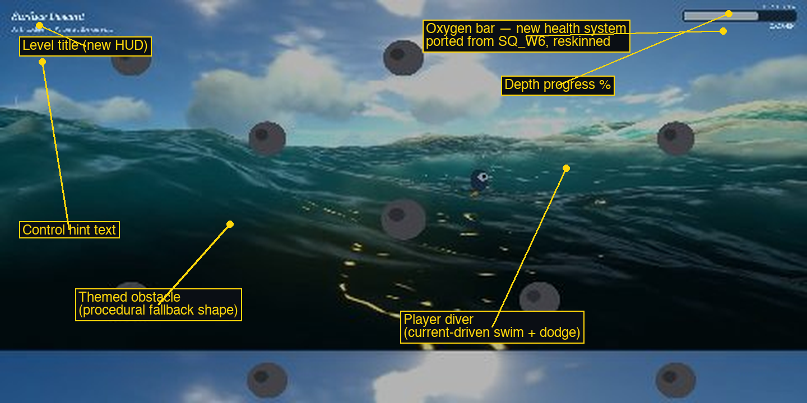

# Getting Under It — Currents

**Week 10 Side Quest — Remix**

A remix that fuses two earlier Side Quests into one game:

- **[Getting Under It](../v5zhao_SQ4)** (Side Quest 4) — a branching visual novel where a scuba diver makes binary story choices, ending in one of 8 outcomes.
- **[Papers Please — Border Checkpoint](../v5zhao_SQ_W6)** (Side Quest 6) — a top-down scroller with camera-follow, JSON-driven obstacles, collision/knockback, and a health HUD.

The remix inserts a real-time "swim down and dodge obstacles" segment — built from SQ_W6's movement/collision/camera engine — in front of every choice screen in the SQ4 story tree. Each narrative branch is now a short playable level instead of a static slide: read the narration, dodge obstacles on the way down, then make your choice once you reach the bottom.

## Concept

Same story as the original *Getting Under It*: you're a diver trying to reach the ocean floor, choosing a path at each of 7 branch points, ending in one of 8 outcomes (triumphs, failures, and ambiguous discoveries). What's new is *how you get from one choice to the next* — instead of clicking through narration, you steer a diver through a themed obstacle field while an ocean current pulls you down.

## Setup and Interaction Instructions

To run the sketch locally, open `index.html` in Google Chrome using Live Server (or any local static server — `loadJSON`/`loadImage` require `http://`, not `file://`).

**Controls (swim levels):**
- **A/D** or **←/→** — strafe sideways to dodge obstacles
- **W** or **↑** — briefly resist the current (slow your descent)
- **S** or **↓** — drop faster
- The current always pulls you down — you don't need to hold anything to descend

**Choice screens:** click one of the two buttons to pick your path, same as the original.

**Endings:** click **Try Again** to restart from the opening.

## Process & Decisions

### Screenshot

*(Screenshot predates the pixel-art background pass and the hearts HUD below — kept for now since it still shows the same swim-level layout.)*

### What was reused from each source, and why

| From | Reused as-is | Why |
|---|---|---|
| SQ4 (*Getting Under It*) | Scene constants, `goTo()`/`resetGame()`, all 7 branch narration/quote/button text, all 8 static ending screens, `drawButton`/`drawNarration`/`drawQuote`/`isMouseOver` helpers | The story, its prose, and its choice-screen presentation didn't need to change — only what happens *between* choices did. |
| SQ_W6 (*Papers Please*) | World/camera/player object shape, `updateCamera()` lerp-scroll, JSON-driven obstacle loading, closest-point circle-vs-box collision, knockback + invincibility-frame pattern, HUD health-bar drawing | This is the only piece of either project that knows how to do real-time movement and collision — rebuilding it from scratch would have meant re-deriving code that already existed and already worked. |

### Three-plus meaningful changes beyond a reskin

1. **New gameplay mechanic** — a current-driven swim: the diver drifts downward automatically, A/D dodge sideways, W briefly resists the current. This replaces SQ_W6's free 4-directional roam and SQ4's click-through narration with something new to both source projects.
2. **New game state** — a `SUBSTATE_SWIMMING` / `SUBSTATE_CHOICE` layer nested inside the existing scene state machine, so every branch scene is really two states in one.
3. **New game system** — an oxygen/hit-point system, shown as three hearts, with per-level obstacle damage, knockback, and invincibility frames, reset fresh at the start of every level (ported from SQ_W6, reskinned, and rebalanced for a no-permadeath diving game rather than a shooter).
4. **New obstacles per branch** — 7 themed hazard layouts (rock clusters, coral, cave stalactites, kelp tangles, shipwreck debris, current rubble) authored as JSON data files, following SQ_W6's data-driven obstacle pattern.
5. **New sound/asset pipeline** — SQ_W6's `hit.mp3` is reused for obstacle collisions; SQ4's `underwater.mp3` is reused as the ambient loop; a dedicated swim-stroke sound is wired up (see *Assets needed*, below).
6. **Combines two prior Side Quests' engines into one game** — one of the remix strategies suggested by the assignment itself.

### Design tradeoffs

- **Current-driven descent vs. free roam** — SQ_W6's shooter let the player move freely in any direction. A diving game about *descending* felt like it should never let you just sit still, so the current always pulls you down; steering only changes how much you fight it. This makes the obstacle fields real hazards instead of optional decoration.
- **Per-level health vs. persistent health** — health resets to full at the start of every swim level, and running out just respawns you at the top of that level's obstacle field. A persistent-health/game-over design was considered, but it would have meant balancing difficulty across 7 chained levels and adding a new "you blacked out" ending state — more scope than the remix needed, for a story that was never about failing the *swim*, only about which *choice* you make.
- **Static endings vs. swim-in endings** — the 8 endings stay exactly like the original (background, narration, quote, "Try Again"). They're terminal — there's no next choice to swim toward — so a dodge segment there would just be a delay, not a decision.

### Pixel-art backgrounds

All 13 background images (7 level backgrounds + 6 unique ending backgrounds) were replaced with original, procedurally-generated pixel art rather than the stock photos SQ4 used. Each is drawn on a small low-resolution canvas (one "pixel" = a 10×10 block) with flat colors and hard edges — no anti-aliasing — then scaled up with nearest-neighbor to the exact size the game needs (`1200 × <level worldH>` for swim levels, `1200 × 800` for endings). The canvas width is fixed at 1200 so no background ever needs to exceed it. Drawing at the *exact* target size, instead of tiling a smaller image, is what eliminates the repeating seam the swim levels used to have — see `drawWorldBackground()` in `sketch.js`, which now stretches each background once instead of tiling it. `noSmooth()` is set in `setup()` so the pixel edges (and the procedurally-drawn player/obstacle shapes) stay crisp instead of getting blurred on scale.

### Assets still worth adding (for future polish)

The player and obstacles are still drawn procedurally too (see `drawPlayer()` / `drawObstacleShape()` in `sketch.js`) — these would be drop-in upgrades in the same pixel-art style, via the commented-out `loadImage`/`loadSound` calls in `preload()`:

- **Diver sprite** — a single ~64×64 transparent PNG, or a directional spritesheet (4 rows × N columns for up/down/left/right swim-cycle frames).
- **Obstacle sprites**, one per theme (~60–100px, transparent PNG): rock/coral cluster, kelp tangle, cave stalactite, shipwreck debris.
- **Swim-stroke sound** — a short water-swoosh sound effect, triggered periodically while the player is moving.

## Assets

| File | Description | Source |
|------|-------------|-------|
| `assets/images/surface.png` | Opening / surface descent background | Original — procedurally generated pixel art |
| `assets/images/dive_fast.png` | Fast-current level background | Original — procedurally generated pixel art |
| `assets/images/dive_slow.png` | Gentle-drift level background | Original — procedurally generated pixel art |
| `assets/images/cave_entrance.png` | Cave level background | Original — procedurally generated pixel art |
| `assets/images/current.png` | Open-water level background | Original — procedurally generated pixel art |
| `assets/images/shipwreck.png` | Shipwreck level background | Original — procedurally generated pixel art |
| `assets/images/kelp_forest.png` | Kelp forest level background | Original — procedurally generated pixel art |
| `assets/images/abyss.png` | Ending: The Abyss | Original — procedurally generated pixel art |
| `assets/images/surface_fail.png` | Endings: Back to the Surface / Wrong Way | Original — procedurally generated pixel art |
| `assets/images/whale.png` | Ending: The Whale | Original — procedurally generated pixel art |
| `assets/images/trench.png` | Ending: The Trench | Original — procedurally generated pixel art |
| `assets/images/shipwreck_interior.png` | Ending: Lost in the Ship | Original — procedurally generated pixel art |
| `assets/images/ocean_floor.png` | Ending: Found the Floor | Original — procedurally generated pixel art |
| `assets/sounds/underwater.mp3` | Ambient background loop | [ShadowsAndEchoes — Fear the Deep Dark Ambient Horror](https://pixabay.com/music/mystery-fear-the-deep-dark-ambient-horror-394143/) |
| `assets/sounds/hit.mp3` | Obstacle-collision sound (reused from SQ_W6) | [Pixabay — Retro Hurt 2](https://pixabay.com/sound-effects/film-special-effects-retro-hurt-2-236675/) |
